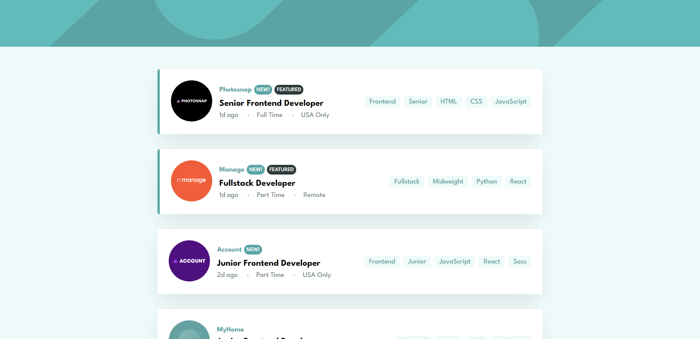

# Frontend Mentor - Job listings with filtering solution

This is a solution to the [Job listings with filtering challenge on Frontend Mentor](https://www.frontendmentor.io/challenges/job-listings-with-filtering-ivstIPCt). Frontend Mentor challenges help you improve your coding skills by building realistic projects.

## Table of contents

- [Frontend Mentor - Job listings with filtering solution](#frontend-mentor---job-listings-with-filtering-solution)
  - [Table of contents](#table-of-contents)
  - [Overview](#overview)
    - [The challenge](#the-challenge)
    - [Screenshot](#screenshot)
    - [Links](#links)
  - [My process](#my-process)
    - [Built with](#built-with)
    - [What I learned](#what-i-learned)
    - [Continued development](#continued-development)
  - [Author](#author)

## Overview

### The challenge

Users should be able to:

- View the optimal layout for the site depending on their device's screen size
- ~~See hover states for all interactive elements on the page~~
- ~~Filter job listings based on the categories~~

### Screenshot

### Links

- Solution URL: [Frontendmentor](https://www.frontendmentor.io/solutions/job-listing-and-filtering-using-pure-javascript-q6Kf_pxqtf)
- Live Site URL: [Demo](https://frontend-mentor-job-listing.netlify.app/)

## My process

### Built with

- Semantic HTML5 markup
- CSS custom properties
- Flexbox
- Vanilla JS

### What I learned

I did this project to polish my vanilla js skills and I have to admit I learnt a lot while building this project. It may not be perfect, but I completed most of the challenge. First of all managing states, conditional rendering in vanilla javascript seems like a big task, but I'm very happy I was able to pull it off! And yes I couldn't make it responsive, I'm not a CSS guru lol.

### Continued development

I could do a better job in rendering I guess, right now it's a very hacky way to render since I'm adding new elements to the dom over and over, you can only go so far without any libraries though.

## Author

- Frontend Mentor - [@kuldp18](https://www.frontendmentor.io/profile/kuldp18)
- Twitter - [@itskuldeep8](https://www.twitter.com/itskuldeep8)
